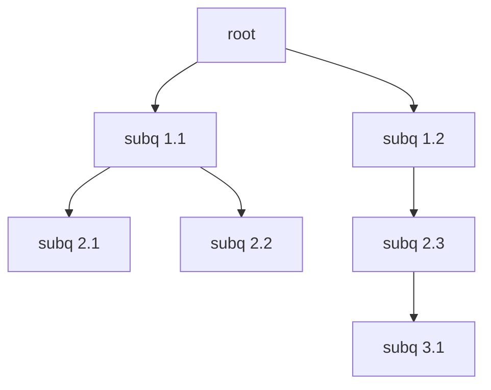

# Sypher

A query language for directed property graph databases with a focus on expressiveness and simplicity.

## Key Features

- Declarative syntax — Write queries that describe what to fetch, not how to fetch it.
- Abstraction - Complex low-level operations are described and executed by simple queries.
- Subqueries - Support for recursive subqueries. 

## Basics of Queries 
Every valid query starts with one of the [supported_operators](#operators) and returns a [tree of queries](#subquery-trees). 
The building blocks of every query are [objects](#objects), [patterns](#match-description-and-pattern-matching), [conditions](#boolean-expression-trees-bet) and [aggregations](#aggregations).

### Objects
Objects are distinct from [QueryObjects](#query-objects) which hold information about a single query. 
Rather, objects refer to constructs that are usable in the query, through the use of their associated keywords. 
Every object has a keyword associated with it (usually it is the objects name spelled in all caps). 
The following types of objects exist:
1. Node
2. Relationship
3. Index
4. Constraint

### Aggregations

## Operators
Only a handfull of operators are supported. However combining them in various ways allows for powerful and versitile queries.

### GET

### REMOVE

### ADD

### UPDATE 

### MATCH 
<code>MATCH 'pattern' WHERE 'conditions' RETURN 'results';</code>

#### MATCH Description and Pattern Matching
Perhabs the most complicated of all operators. It allows for the matching of a pattern against the graph. 
This can be thought of as a canvas of large geometric forms (the graph represented by the database) and a smaller geometric form (the pattern specified in the MATCH statement). What the MATCH operator does is, that it takes the smaller geometric form and searches where it matches (hence the operators name) the existing forms on the canvas. Thereafter the results are filtered and aggregated before they are returned.

#### Syntax
<code>pattern</code> is a construct that is made up of <strong>nodes</strong> and <strong>relationships</strong>. 
A <code>pattern</code> must contain at least one node and exactly n-1 relationships with n being the number of nodes in the pattern. 
 

    <strong>Nodes</strong> are denoted with parenthesis <code>()</code> in the following way: 
    <code>(identifier_name:node_type)</code> 
    <code>idenfier_name</code> introduces a variable that may be used in later parts of the statement. 
    <code>identifier_name</code> must be unique, otherwise the query will not execute.
    This may be elided should no specific <code>identifier_name</code> be needed. 
    In this case, a new <code>identifier_name</code> will still be introduced, it will only get an auto-generated name assigned to it.
    For elision of the <code>identifier_name</code>, the syntax <code>(node_type)</code> is used. 
    <code>node_type</code> introduces a restriction on the <code>identifier_name</code>s type, as it can only be of type <code>node_type</code>. 
    This may also be elided, in which case no restriction is set on the node.
    The syntax <code>(identifier_name:)</code> is used for this. 
    Both elisions may also be combined: <code>()</code> is a valid node. 

    <strong>Relationships</strong> have a similar syntax that makes use of square brackets <code>[]</code>:
    <code>[identifier_name:relationship_type]</code> 
    The same rules for elision of either <code>identifier_name</code> or <code>relationship_type</code> or both apply.  
    A <strong>relationship</strong> must also be specified with a <strong>direction</strong>, that may be in- or outgoing. 
    <strong>Directions</strong> are interpreted from left to right. 
    Ingoing relationships are therefore denoted like this: 
        <code>(n1) <- (n2)</code> or with a restricted relationship <code>(n1) <-[r:rel_type]- (n2)</code>.
     
    This reads "The node n1 has an ingoing relationship r of type rel_type from node n2." 
     
    Outgoing relationships are denoted like this: 
        <code>(n1) -> (n2)</code> or, again, with a restricted relationship <code>(n1) -[r:rel_type]-> (n2)</code>. 
     
    This reads "The node n1 has an outgoing relationship r of type rel_type to node n2." 
     
    It should be noted here that not specifying 
            <code>identifier_name</code> or <code>relationship_type</code> 
            but keeping the brackets <code>[]</code> is also valid: 
            <code>(n1) -[]-> (n2)</code>.
     

## Subqueries
In Sypher, a subquery is initialized with the keyword <code>SUBQ</code>. 
The subquery is placed directly after that in curly brackets <code>{}</code>. 
A valid subquery looks like this: 
<code>GET NODE SUBQ{MATCH (p:Person) -[LIKES]-> (f:Food) WHERE f.name = "Pizza" RETURN p.id LIMIT 1}</code> 
(Return the node of a person that likes Pizza.)

### Recursive subqueries
Subqueries can be nested and are parsed recursively. 
For example, this is a valid query: 
<code>GET NODE SUBQ{MATCH (p:Person) -[most_popular_relationship:SUBQ{MATCH (p:Person) -[r:]-> () WHERE p.name = "Edos" RETURN r.type_name SORT BY COUNT(r.type_name) DESC LIMIT 1}]-> (unknown:) RETURN unknown.id}</code> 
(Return the first node with the most popular outgoing relationship type for a person named Edos.)

### Subquery Trees
Every query returns a Subquery Tree, a tree that holds every subquery with its dependencies.
The root of the tree is always the original query.
If there is no subquery, the tree consists only of the root node. 
Every node holds references to the subqueries it depends on. 
This tree structure is what enables [recursive subqueries](#recursive-subqueries).

The following (invalid) query serves as an example.  
<code>OPERATION root SUBQ{subq 1.1 SUBQ{subq 2.1} SUBQ{subq 2.2}} WHERE SUBQ{subq 1.2 SUBQ{subq 2.3 SUBQ{subq 3.1}}}</code> 
(Invalid query with nested subqueries to illustrate subquery tree structure.)
It will result in the following tree structure:

### Tree Traversal
When processed, the tree is traversed levelwise from the bottom up. It will start at the leaf node with the greatest depth ("subq3.1" in the [above example](#subquery-trees).
The leaf nodes are processsed first since they are not dependent on other subqueries to be executed first. 
In contrast, all internal nodes must have at least one subquery that needs to be executed before they are. 
Internally, the traversal has the following steps: 
1. Start traversal from the trees root.
2. Traverse the entire tree with breadth-first-search. Save references to all visited nodes in a vector v.
3. Reverse v to get the correct order.

### String Replacement
The tree stores the start and end index in the original (or root) query for each subquery. 
This makes it possible for the runtime-query-interpreter-engine to replace the entire subquery-string with a string-representation of the result of its execution.

### Query Objects
Every successfully parsed single query (one node of the query-tree) will return a <code>QueryObject</code> which stores the extracted information about the query.
This includes the [operator](#operators) and data associated with it.

## Boolean Expression Trees (BET)
Also called "Binary Expression Trees". 

