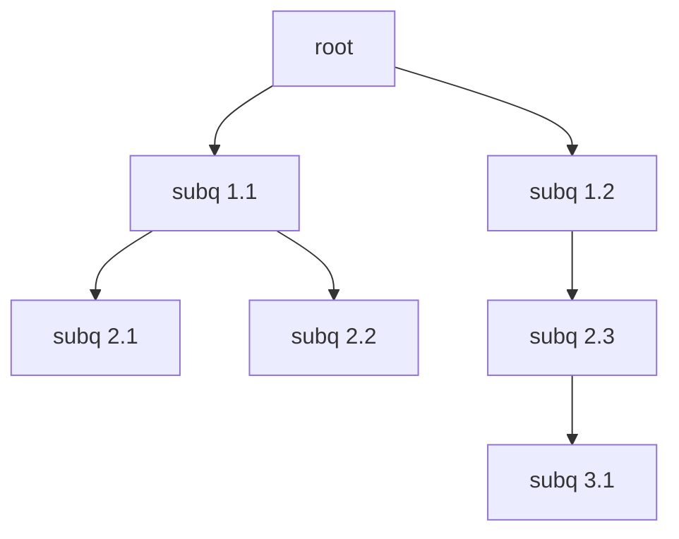

# Sypher

A query language for directed property graph databases with a focus on expressiveness.

## Key Features

- Declarative syntax — Write queries that describe what to fetch, not how to fetch it.
- Abstraction - Complex low-level operations are described and executed by simple queries.
- Subqueries - Support for recursive subqueries. 

## Subqueries
In Sypher, a subquery is initialized with the keyword <code>SUBQ</code>. 
The subquery is placed directly after that in curly brackets. 
A valid subquery looks like this: 
<code>GET NODE SUBQ{MATCH (p:Person) -[LIKES]-> (f:Food) WHERE f.name = "Pizza" RETURN p.id LIMIT 1}</code> 
(Return the node of a person that likes Pizza.)

### Recursive subqueries
Subqueries can be nested and are parsed recursively. 
For example, this is a valid query: 
<code>GET NODE SUBQ{MATCH (p:Person) -[most_popular_relationship:SUBQ{MATCH (p:Person) -[r:]-> () WHERE p.name = "Edos" RETURN r.type_name SORT BY COUNT(r.type_name) DESC LIMIT 1}]-> (unknown:) RETURN unknown.id}</code> 
(Return the first node with the most popular outgoing relationship type for a person named Edos.)

### Subquery Trees
Every query returns a Subquery Tree, a tree that holds every subquery with its dependencies.
The root of the tree is always the original query.
If there is no subquery, the tree consists only of the root node. 
Every node holds references to the subqueries it depends on. 
This tree structure is what enables [recursive subqueries](#recursive-subqueries).

The following (invalid) query serves as an example.  
<code>OPERATION root SUBQ{subq 1.1 SUBQ{subq 2.1} SUBQ{subq 2.2}} WHERE SUBQ{subq 1.2 SUBQ{subq 2.3 SUBQ{subq 3.1}}}</code> 
(Invalid query with nested subqueries to illustrate subquery tree structure.)
It will result in the following tree structure:

### Tree Traversal
When processed, the tree is traversed levelwise from the bottom up. It will start at the leaf node with the greatest depth ("subq3.1" in the [above example](#subquery-trees).
The leaf nodes are processsed first since they are not dependent on other subqueries to be executed first. 
In contrast, all internal nodes must have at least one subquery that needs to be executed before they are. 
Internally, the traversal has the following steps: 
1. Start traversal from the trees root.
2. Traverse the entire tree with breadth-first-search. Save references to all visited nodes in a vector v.
3. Reverse v to get the correct order.

### String Replacement
The tree stores the start and end index in the original (or root) query for each subquery. 
This makes it possible for the runtime-query-interpreter-engine to replace the entire subquery-string with a string-representation of the result of its execution.

