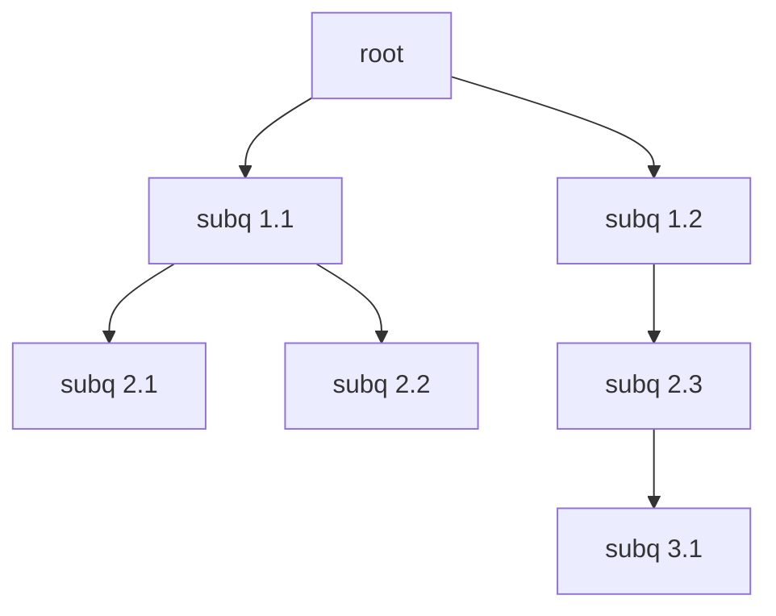
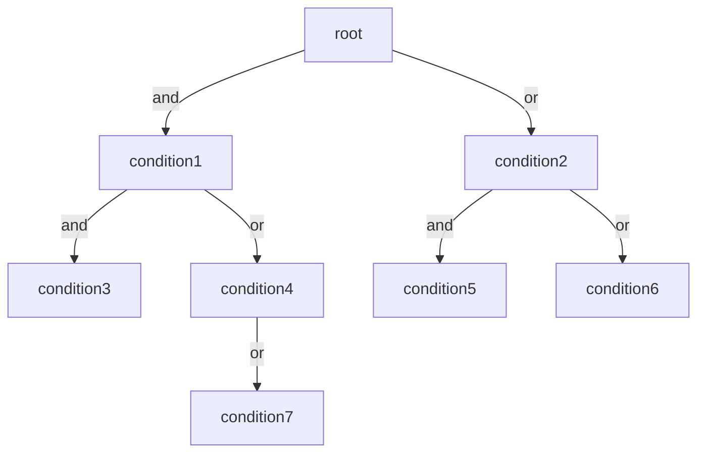

# Internals

Internal data structures are described here.

## Contents
- [Subquery Trees](#subquery-trees)
- [Boolean Expression Trees for conditions](#boolean-expression-trees-bet)

## Subquery Trees
Every query returns a Subquery Tree, a tree that holds every subquery with its dependencies.
The root of the tree is always the original query.
If there is no subquery, the tree consists only of the root node. 
Every node holds references to the subqueries it depends on. 
This tree structure is what enables [recursive subqueries](https://github.com/maliklambda/Sypher/blob/master/docs/reference.md#recursive-subqueries).

The following (invalid) query serves as an example.  
<code>OPERATION root SUBQ{subq 1.1 SUBQ{subq 2.1} SUBQ{subq 2.2}} WHERE SUBQ{subq 1.2 SUBQ{subq 2.3 SUBQ{subq 3.1}}}</code> 
(Invalid query with nested subqueries to illustrate subquery tree structure.)
It will result in the following tree structure:

### Tree Traversal
When processed, the tree is traversed levelwise from the bottom up. It will start at the leaf node with the greatest depth ("subq3.1" in the [above example](#subquery-trees).
The leaf nodes are processsed first since they are not dependent on other subqueries to be executed first. 
In contrast, all internal nodes must have at least one subquery that needs to be executed before they are. 
Internally, the traversal has the following steps: 
1. Start traversal from the trees root.
2. Traverse the entire tree with breadth-first-search. Save references to all visited nodes in a vector v.
3. Reverse v to get the correct order.  
The [above example](#subquery-trees) will yield the vector <code>[subq3.1, subq2.3, subq2.2, subq2.1, subq1.2, subq1.1, root]</code>.

### String Replacement
The tree stores the start and end index in the original (or root) query for each subquery. 
This makes it possible for the runtime-query-interpreter-engine to replace the entire subquery-string with a string-representation of the result of its execution.

### Query Objects
Every successfully parsed single query (one node of the query-tree) will return a <code>QueryObject</code> which stores the extracted information about the query.
This includes the [operator](https://github.com/maliklambda/Sypher/blob/master/docs/reference.md#syntax-reference) and data associated with it.
 
 

## Boolean Expression Trees (BET)
Also called "Binary Expression Trees" or simply "Condition Trees". 
They are internal tree structures to represent the conditions of a [WHERE](https://github.com/maliklambda/Sypher/blob/master/docs/reference.md#match) clause. 
Each node in the BET holds a FilterCondition, an expression that evaluates to a boolean-value. 
A condition is applied at runtime to the results of a [matched pattern](https://github.com/maliklambda/Sypher/blob/master/docs/reference.md#match-description-and-pattern-matching). 
Furthermore, a node optionally holds a reference to following nodes that are connected either through the <code>AND</code> or the <code>OR</code> operator.
(Please note that negated conditions using <code>NOT</code> are currently in the works.)
In the following, the child connected by <code>AND</code> is referred to as the left child.
Conversely, the child connected by <code>OR</code> is called the right child.

Conditions are parsed sequentially. 
This means that the expressions <code>WHERE A AND B OR C</code> and <code>WHERE A AND (B OR C)</code> are equivalent.
Similarly, the expressions <code>WHERE A OR B AND C</code> and <code>WHERE A OR (B AND C)</code> are equivalent.

For convenience, the root node is initially set to an empty node with a constant condition that will always evaluate to true. 
However, this node is kept only temporarily and the empty root-node is removed from the tree before the runtime executes it. 
The example above corresponds to the following <code>WHERE</code>-clause: 
<code>
WHERE ((condition1 OR condition4 OR condition7) AND condition3) OR (condition2 AND condition5) OR condition6
</code>
 
It should be noted here that nested conditions using <code>connection_group</code> characters <code>(</code> and <code>)</code> is still in the works, as this requires a condition's child to either be an atomic condition or a BET itself to remove all ambiguity. 
As of now, only atomic conditions, such as e.g. <code>WHERE condition1 AND condition2 OR condition3</code>, are supported.

### BET Traversal
A [BET](#boolean-expression-trees-bet) is traversed using a DFS-like algorithm (that also resembles inorder traversal of a binary tree).
The algorithm looks for a node that satisfies the following two conditions:
1. It has no child that is connected to it by <code>AND</code>.
2. The node's condition evaluates to true.
 
If a node's condition evaluates to false, then the entire left subtree (and-connected) will be discarded, as the expression can never evaluate to true in that case (at least not through said subtree).
However, the right subtree (or-connected) can still yield a true value that will result in a true expression.
So the traversal, upon encountering a node with a false condition, will continue with the node's right (or-connected) subtree.
